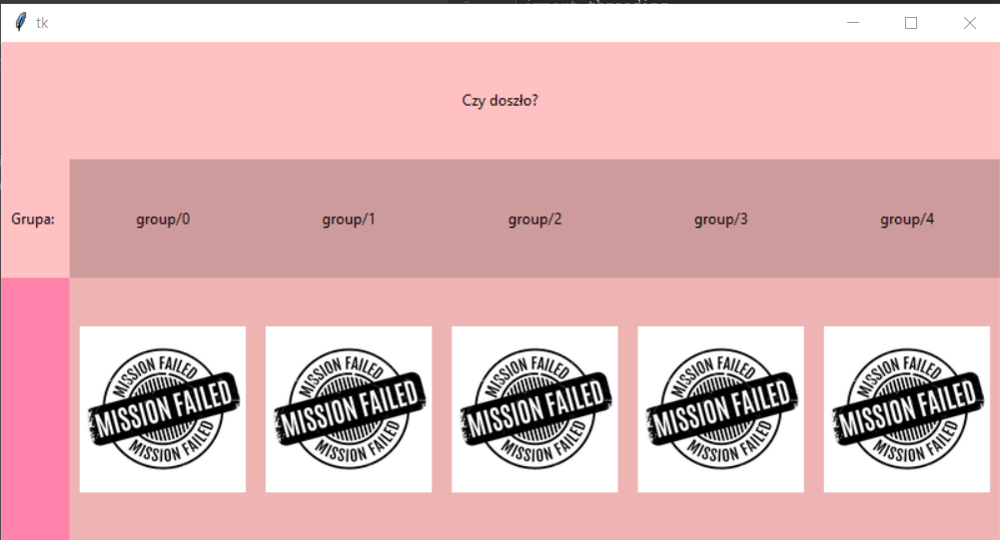

# MQTT_app
> Short blurb about what your product does.

## Broker
Firstly you need a MQTT broker. You can set it on Virtual Machine. Change configuration of network to bridged network connection. 
Secondly, ypu need to install mosquitto Broker on your VM, using commands:

```sh
sudo apt-get update
sudo apt-get install mosquitto
sudo apt-get install mosquitto-clients
```
Then if you need to create new account on broker and add password you need to type:

```sh
sudo mosquitto_passwd -c /etc/mosquitto/passwd <user_name>
```
Then you will be asked to type a password. 

Then if you want to have password to get to the broker, you need to type
```sh
sudo gedit /etc/mosquitto/mosquitto.conf
```
And add two lines to this configuration file:
```sh
password_file /etc/mosquitto/passwd
allow_anonymous false
```
From now to connect with the broker you need to give username and password. 
To turn on mosquitoo broker type:
```sh
mosquitto
```

##  Application

Application sends to every group (it's now set to 5) random number. Every gruop is pleased to take a message on topic group/X, where X is number of group (from 0 - 4). When group received the message, it has to send this same number it got to topic: answer/group/X. When everythong is fine, in the proper place the image should change to Mission complete. 

This picture presents the situation, when no group reached the goal. 


To make this project work you need to change: 
IP addres of broker - you can obtain it using command:
```sh
ifconfig
```
username and password of broker. 

## Simulating MQTT client
You can use ESP or another computer (with Linux I recommand it may be even the same VM as broker) in the same network. To simulate MQTT client behaviour type:
To publish for group one:
```sh
mosquitto_pub -d -u username -P catato -t answer/group/1 -m 27
```
To subscribe for group one:
```sh
mosquitto_sub -d -u username -P catato -t group/1
```

Enjoy :D
